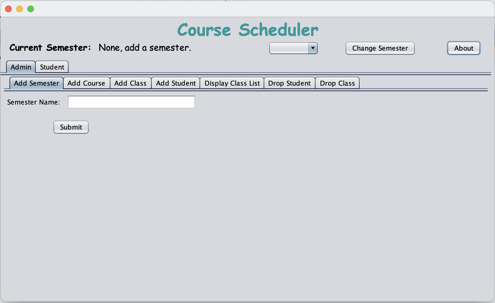
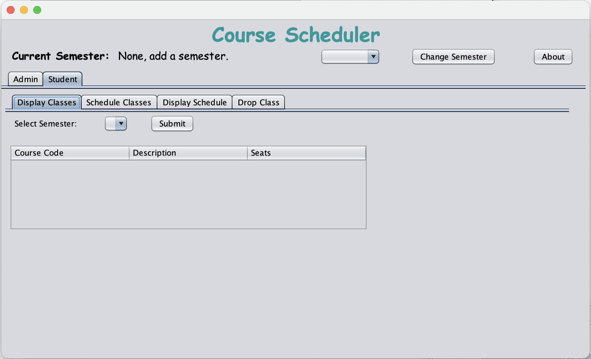

# 📚 Course Scheduler Application (CMPSC 221)

Java Swing desktop app to manage **semesters**, **courses**, **classes/sections**, **students**, and **enrollments** using **Apache Derby (Network Client)**. Built in **Apache NetBeans**.

---

## 📸 Screenshots 

### Admin Section

### Student Section

### Admin
- Create **Semesters**
- Add **Courses** and **Classes/Sections** (with capacity)
- Adds and drops **Students** while adjusting the **Class/Sections** capacity
- View class rosters (scheduled vs waitlisted)
- Drop classes (updates enrollments)

### Student
- Create **Student** records
- **Register / Waitlist** for classes
- **Add/Drop** a class
- View **My Schedule** by semester

---

## 🛠 Tech
- Java (JDK 23), Swing/AWT
- Apache NetBeans (Ant project)
- Apache Derby 10.17 — **Network Server** mode
- JDBC driver: `org.apache.derby.jdbc.ClientDriver`
